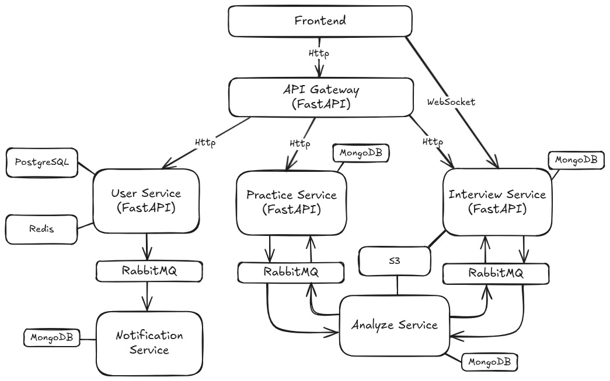

# AI Interview Tutor — Backend

Backend services for an AI-assisted technical interview platform: REST authentication and user APIs, a real-time interview agent over WebSockets, asynchronous CV analysis (PDF from object storage through an LLM into MongoDB), and email notifications driven by RabbitMQ. The repository is structured as a **production-ready** polyglot backend—environment-driven configuration, durable messaging with separate job and result routes for CV analysis, layered domain/application/infrastructure code in each service, and Compose-based local stacks that mirror deployment boundaries.

---

## Table of contents

- [Overview](#overview)
- [Architecture](#architecture)
- [Repository layout](#repository-layout)
- [Root tooling and repository hygiene](#root-tooling-and-repository-hygiene)
- [Shared library: `jwt_handler`](#shared-library-jwt_handler)
- [Services](#services)
  - [User Management](#user-management-service)
  - [Interview](#interview-service)
  - [Analyze](#analyze-service)
  - [Notification](#notification-service)
- [Data stores](#data-stores)
- [Prerequisites](#prerequisites)
- [Quick start](#quick-start)
- [Development](#development)
- [License](#license)

---

## Overview

| Component | Type | Responsibility |
|-----------|------|----------------|
| [user-management-service](user-management-service) | HTTP (FastAPI) | Users, JWT auth (RS256), profiles, refresh-token rotation with Redis, password-reset API integrated with Notification, RabbitMQ publishing for CV jobs and notifications |
| [interview-service](interview-service) | HTTP + WebSocket | LangGraph-driven interview flow, bundled static demo client, configurable checkpointing for scaled deployments |
| [analyze-service](analyze-service) | Worker | Consume jobs from **`cv-analyze-stream`** → fetch PDF from S3 → extract text → structured `CVData` via LLM → MongoDB → publish results to **`cv-analysis-results`** |
| [notification-service](notification-service) | Worker | Consume **`reset-password-stream`** jobs → persist outbound mail metadata → send via AWS SES |
| [libs/jwt_handler](libs/jwt_handler) | Python package | JWT encode/decode, token DTOs, shared defaults for algorithm and TTLs |

---

## Architecture

High-level view of the platform (API gateway, services, RabbitMQ, databases, and S3). This repository ships the **User Management**, **Interview**, **Analyze**, and **Notification** backends; the diagram includes adjacent components for full-system context.



**Synchronous paths.** Clients talk HTTP to **User Management** (Postgres, Redis; RabbitMQ readiness ensured at startup) and HTTP/WebSocket to **Interview** (checkpointing aligned with single-instance or scaled deployment profiles).

**Asynchronous paths.** **Analyze** consumes **`cv-analyze-stream`**, persists structured CV data, and publishes **`cv-analysis-results`**. **Notification** consumes **`reset-password-stream`**. Workers use durable queues, integrate with S3, MongoDB, and SES, and acknowledge or negative-acknowledge messages according to each adapter’s rules.

| Kind | Service | Typical command | Role |
|------|---------|-----------------|------|
| HTTP | [user-management-service](user-management-service) | `uvicorn src.main:app` | Auth and user APIs |
| HTTP | [interview-service](interview-service) | `uvicorn src.main:app` | WebSocket interview + static demo |
| Worker | [analyze-service](analyze-service) | `python -m src.main` | CV analysis pipeline |
| Worker | [notification-service](notification-service) | `python -m src.main` | Transactional email |

---

## Repository layout

| Path | Role |
|------|------|
| [user-management-service/](user-management-service/) | FastAPI app, domain/application/infrastructure layers, Alembic migrations, aio-pika producer for **`cv-analyze-stream`** and **`reset-password-stream`**, Redis refresh-token rotation and reuse detection |
| [interview-service/](interview-service/) | FastAPI router, LangGraph [`workflow`](interview-service/src/agent/workflow.py), LLM factory ([`llm.py`](interview-service/src/agent/llm.py)), static [`interview_client.html`](interview-service/src/static/interview_client.html) |
| [analyze-service/](analyze-service/) | [`dependency-injector`](analyze-service/src/containers/container.py) composition root, aio-pika consumer on **`cv-analyze-stream`**, producer to **`cv-analysis-results`**, S3 + Mongo + LangChain CV parser |
| [notification-service/](notification-service/) | Blocking **pika** consumer on **`reset-password-stream`**, [`ResetPasswordUseCase`](notification-service/src/application/use_cases/reset_password_use_case.py), Mongo repository + SES adapter |
| [libs/jwt_handler/](libs/jwt_handler/) | Reusable JWT handling consumed by user-management ([`pyproject.toml`](user-management-service/pyproject.toml) Git or path dependency) |
| [pyproject.toml](pyproject.toml) / [poetry.lock](poetry.lock) | Repository-root Poetry project: pins shared dev tooling and locks root dependency versions |
| [.pre-commit-config.yaml](.pre-commit-config.yaml) | Hooks run Black, Ruff, and scoped mypy |
| [.gitignore](.gitignore) | Ignores `.env`, virtualenvs, IDE metadata, bytecode |

---

## Root tooling and repository hygiene

### [`pyproject.toml`](pyproject.toml) (root)

- Declares **`python = "^3.12"`**.
- Root **`[tool.poetry.dependencies]`** includes shared packages such as [`motor`](https://motor.readthedocs.io/) where scripts or future shared tooling need MongoDB async access alongside service-local stacks.
- **Dev dependencies:** `pre-commit`, `black`, `mypy`, `ruff`.
- **[tool.black]** — `line-length = 120`.
- **[tool.ruff]** — `target-version = "py312"`, `line-length = 120`, excludes Alembic migrations under user-management and prompt directories under analyze/interview.

### [`.pre-commit-config.yaml`](.pre-commit-config.yaml)

| Hook | Scope / notes |
|------|----------------|
| `trailing-whitespace`, `end-of-file-fixer`, `check-added-large-files` | Whole repo |
| **Black** `25.1.0`, `language_version: python3.12` | Whole repo |
| **Ruff** via `ruff-pre-commit` | Whole repo |
| **mypy** `v1.15.0`, hook entries | Files under `^user-management-service/` and `^interview-service/`; `additional_dependencies: [types-PyYAML]` |

Additional services can opt into the same hooks by extending the configuration as the codebase grows.

### [`.gitignore`](.gitignore)

Ignores `.env`, `venv/`, `.idea/`, `__pycache__/`. Service-specific artifacts (for example Compose volumes) are not globally ignored—prefer keeping machine-local paths out of commits manually.

---

## Shared library: [`jwt_handler`](libs/jwt_handler)

**Purpose.** Centralize RS256 JWT creation and verification for microservices that share RSA keys.

**Package metadata.** [`libs/jwt_handler/pyproject.toml`](libs/jwt_handler/pyproject.toml) — package name `jwt_handler`, Python **`>=3.9`** (services use 3.12).

**Core types.**

- [`JWTTokenHandler`](libs/jwt_handler/jwt_handler/handlers/token_handler.py) — `encode_jwt` / `decode_jwt` using PyJWT; maps PyJWT exceptions to library-specific errors.
- Defaults for **`algorithm`** (`RS256`) and token TTL fields live on [`JWTSettings`](libs/jwt_handler/jwt_handler/config.py). Optional YAML under key `jwt_handler` via `load_from_yaml()` complements environment-first configuration for local profiles.

**Consumption in user-management.** [`user-management-service/pyproject.toml`](user-management-service/pyproject.toml) pulls `jwt-handler` from Git (`branch = dev`, `subdirectory = libs/jwt_handler`). For forks or offline work, switch to a **`path`** dependency pointing at [`libs/jwt_handler`](libs/jwt_handler).

**Imports.** Prefer explicit submodule imports (`jwt_handler.models`, `jwt_handler.value_objects`, etc.). The package [`__init__.py`](libs/jwt_handler/jwt_handler/__init__.py) does not re-export the public API.

---

## Services

### User Management Service

**Entrypoints.** [`src/main.py`](user-management-service/src/main.py) builds FastAPI with [`lifespan`](user-management-service/src/lifespan.py): obtains Redis and async SQLAlchemy engine via dependency helpers, **waits for RabbitMQ readiness** (`wait_for_rabbitmq`), then serves requests; on shutdown closes Redis and the engine.

**Configuration.** [`src/config.py`](user-management-service/src/config.py) via `pydantic-settings`:

| Group | Env prefix / keys | Purpose |
|-------|-------------------|---------|
| Postgres | `POSTGRES_*` | Async URL `postgresql+asyncpg://…` |
| SQLAlchemy | (defaults on `SQLAlchemySettings`) | Pool size, echo |
| Redis | `REDIS_*` | Host, port, passwords, `decode_responses` |
| JWT RSA | `PUBLIC_KEY`, `PRIVATE_KEY` | PEM strings for RS256 |
| RabbitMQ | `RABBITMQ_*` | URL builder; `cv_analyzer_queue_name` defaults to **`cv-analyze-stream`**; connection wait **`timeout`** |

**Layering.**

- **Domain** — entities such as [`User`](user-management-service/src/domain/entities/user.py) (`UserRole`, timestamps), repository interfaces, Redis/RabbitMQ ports.
- **Application** — use cases (registration, login, refresh, CRUD, delete me, password reset). [`RefreshTokenUseCase`](user-management-service/src/application/use_cases/auth/refresh_token_use_case.py): decode refresh JWT, verify `TokenType.REFRESH`, load user, reject blocked users, **reject reuse** if `refresh-key:{token}` already exists in Redis, otherwise issue new access + refresh pair and **`SETEX` the old refresh token key** so it cannot be reused until expiry window ends.
- **API** — FastAPI routers under [`api/v1`](user-management-service/src/api/v1/router.py), global exception wiring [`exception_handler`](user-management-service/src/api/exception_handler.py), OAuth2 scheme [`security.py`](user-management-service/src/api/security.py) with `tokenUrl="/api/v1/auth/token"`.

**Messaging.** [`RabbitMQProducer`](user-management-service/src/infrastructure/rabbitmq/rabbitmq_producer.py) implements [`IRabbitMQProducer`](user-management-service/src/domain/interfaces/rabbitmq/rabbitmq_producer.py): **aio-pika**, durable queues, persistent messages on the default exchange with `routing_key = queue_name`. Application use cases publish CV analysis jobs to **`cv-analyze-stream`** and password-reset payloads to **`reset-password-stream`** as users progress through signup, profile updates, and account recovery.

**Auth HTTP surface** includes `POST /api/v1/auth/signup`, `POST /api/v1/auth/token`, `POST /api/v1/auth/refresh`, `POST /api/v1/auth/reset-password`, and `POST /api/v1/auth/reset-password/{token}`. Integration tests cover this surface under [`test_reset_password.py`](user-management-service/tests/integration_tests/auth/test_reset_password.py).

**Persistence.** Alembic under [`src/migrations`](user-management-service/src/migrations); initial [`users`](user-management-service/src/migrations/versions/0167f6ba46f8_add_users_table.py) table with unique email/username/phone constraints.

**Containers.** [`docker-compose.yaml`](user-management-service/docker-compose.yaml): Postgres 12, Redis 8 with ACL file, RabbitMQ 4.1 management image. [`Dockerfile`](user-management-service/Dockerfile): multi-stage Poetry install, `uvicorn src.main:app`.

---

### Interview Service

**Entrypoints.** [`src/main.py`](interview-service/src/main.py): mounts [`/api/v1`](interview-service/src/api/v1/router.py) and static files at **`/static`**; root `GET /` returns JSON pointing to **`/static/interview_client.html`**.

**Configuration.** [`src/config.py`](interview-service/src/config.py): YAML-backed logging (`config.yaml` → `logger` key), nested LLM settings via Pydantic Settings:

- **`google_llm`** — default model `gemini-2.0-flash`, configurable temperature; env vars such as `GOOGLE_API_KEY`, `GOOGLE_LLM__MODEL` ([`.env.example`](interview-service/.env.example)).
- **`custom_llm`** — OpenAI-compatible client defaults (`ai/gemma3`, base `http://localhost:12434/engines/v1`) for local experimentation.

**LLM wiring.** [`src/agent/llm.py`](interview-service/src/agent/llm.py): `LLMFactory.create_google_llm()` supplies the default graph LLM (Gemini); alternative factories support other deployment profiles.

**Agent graph.** [`create_interview_workflow()`](interview-service/src/agent/workflow.py): LangGraph `StateGraph` over [`InterviewState`](interview-service/src/domain/models/interview_state.py). Nodes include greeting, soft/hard question askers, small talk, wrap-up, question routing, and answer evaluation. Conditional edges:

- `section_router` — drives high-level stage transitions (including end).
- `question_router_decision` — async LLM classification (`SMALLTALK` vs continuing soft/hard questioning using [`QUESTION_ROUTER_DECISION_PROMPT`](interview-service/src/agent/prompts/question_router_decision.py)).

**Checkpointing** is LangGraph-compatible and configurable: lean defaults for local demos, durable backends where multiple instances share interview state.

**WebSocket contract.** [`websocket_endpoint`](interview-service/src/api/v1/endpoints/interview.py) at **`/api/v1/interview/ws/{user_id}`** delegates to [`InterviewConnectionManager`](interview-service/src/api/v1/managers/interview_manager.py).

- Client JSON **`type`**: `user_message` (requires `content`), `end_interview`, `get_status`; unknown types fall back to forwarding `content` as user text.
- Server JSON examples: `interview_started`, `agent_message` (includes `stage`), `interview_status`, `interview_complete`, `error`.

**Reference demo vs production profile.** [`SAMPLE_CV`](interview-service/src/agent/data/sample_data.py) backs the static demo. Production deployments bind **`user_id`** and CV context to authenticated sessions and structured outputs from **Analyze** (for example documents keyed by user or correlation id), so the agent tailors dialogue to the candidate’s profile.

**Dependencies.** [`interview-service/pyproject.toml`](interview-service/pyproject.toml): FastAPI with websockets, LangGraph + SQLite extras, LangChain Google GenAI, checkpoint SQLite, pydantic-settings.

---

### Analyze Service

**Entrypoints.** [`src/main.py`](analyze-service/src/main.py): wires [`Container`](analyze-service/src/containers/container.py), waits for RabbitMQ, runs **`await rabbitmq_consumer.process_messages()`** (async forever).

**Configuration.** [`src/config.py`](analyze-service/src/config.py): **`S3_*`**, **`RABBITMQ_*`** (inbound **`cv-analyze-stream`**, results **`cv-analysis-results`**), **`MONGODB_*`** (includes **`cv_analysis_collection_name`**). Logging can be driven from [`config.yaml`](analyze-service/config.yaml) via the container’s `dictConfig` resource.

**Pipeline.** [`RabbitMQConsumer`](analyze-service/src/adapters/inbound/rabbitmq_consumer.py):

- **aio-pika** `connect_robust`, **`prefetch_count=5`**, durable subscription on **`cv-analyze-stream`**.
- On message: JSON decode; if **`routing_key`** equals configured analyzer queue name → [`CVAnalyzeUseCase`](analyze-service/src/use_cases/cv_analyze_use_case.py).

[`CVAnalyzeUseCase`](analyze-service/src/use_cases/cv_analyze_use_case.py):

1. Parse [`CVInitialAnalysisMessage`](analyze-service/src/domain/models/cv_analyze_messages.py).
2. Download PDF bytes from S3 using message **`url`** ([`IS3Client`](analyze-service/src/domain/adapters/outbound/s3.py)).
3. Extract text in a thread ([`IPDFLoader`](analyze-service/src/domain/adapters/outbound/pdf_loader.py), PyPDF-based implementation).
4. Run [`CVAnalyzer`](analyze-service/src/agent/services/cv_analyzer.py): LangChain structured output into [`CVData`](analyze-service/src/domain/models/cv_data.py).
5. `insert_one` document into Mongo ([`IMongoRepository`](analyze-service/src/domain/adapters/outbound/mongo.py)).
6. Publish [`CVResultAnalysisMessage`](analyze-service/src/domain/models/cv_analyze_messages.py) as JSON via [`RabbitMQProducer`](analyze-service/src/adapters/outbound/rabbitmq_producer.py) to **`cv-analysis-results`**.

**Docker.** [`docker-compose.yaml`](analyze-service/docker-compose.yaml): app service depends on RabbitMQ, MongoDB (Bitnami 5.0), LocalStack for S3. [`Dockerfile`](analyze-service/Dockerfile): worker-oriented image running **`python3 -m src.main`** (the default runtime is the async consumer, not an HTTP server).

---

### Notification Service

**Entrypoints.** [`src/main.py`](notification-service/src/main.py): synchronous **`main()`** — waits for RabbitMQ, starts blocking consumer, closes Mongo on exit.

**Packaging.** [`pyproject.toml`](notification-service/pyproject.toml) uses PEP 621 **`[project]`** metadata while retaining **`poetry-core`** as the build backend; dependencies include **pika**, **pymongo**, **boto3**, **dependency-injector**.

**Configuration.** [`src/config.py`](notification-service/src/config.py):

| Group | Env prefix | Notes |
|-------|------------|--------|
| RabbitMQ | `RABBITMQ_*` | Defaults: host `rabbitmq`, port `5672` |
| MongoDB | `MONGODB_*` | Defaults: host `mongodb`, port `27017`; URI construction supports **`authSource`** and related cluster settings |
| SES | `SES_*` | `AWS_ACCESS_KEY`, `AWS_SECRET_ACCESS_KEY`, region, sender |

**Pipeline.** [`RabbitMQConsumer`](notification-service/src/adapters/inbound/rabbitmq_consumer.py): **blocking pika**, durable queue **`reset-password-stream`**, **`prefetch_count=5`**. Successful handling **`basic_ack`**; failures **`basic_nack(..., requeue=False)`** after logging.

[`ResetPasswordUseCase`](notification-service/src/application/use_cases/reset_password_use_case.py): validates [`ResetPasswordMessageModel`](notification-service/src/models/reset_password_message.py), inserts into Mongo via repository context manager, retries SES send up to **five** times; raises [`NotSentError`](notification-service/src/domain/exceptions/not_sent_error.py) if every attempt fails.

**Outbound wiring.** [`OutboundAdaptersContainer`](notification-service/src/containers/outbound_adapters.py): singleton `MongoClient`, factory `SESClient` wrapping boto3 SES.

There is **no** `.env.example` in this service; infer required variables from [`config.py`](notification-service/src/config.py).

---

## Data stores

| Technology | Service | Usage |
|------------|---------|--------|
| **PostgreSQL** | user-management | `users` table · Alembic revision [`0167f6ba46f8`](user-management-service/src/migrations/versions/0167f6ba46f8_add_users_table.py) |
| **Redis** | user-management | Refresh-token reuse prevention / rotation bookkeeping (`refresh-key:{token}`) |
| **MongoDB** | analyze-service | CV analysis documents in `MONGODB_CV_ANALYSIS_COLLECTION_NAME` |
| **MongoDB** | notification-service | Outbound message records in `MONGODB_MESSAGES_COLLECTION_NAME` |
| **S3** | analyze-service | CV PDF objects (LocalStack or AWS) · vars `S3_*` |
| **AWS SES** | notification-service | Email delivery · `SES_*` + boto3 client |

---

## Prerequisites

- **Python 3.12** for all runnable services
- **[Poetry](https://python-poetry.org/)** — install per service directory
- **Docker / Docker Compose** — optional but practical for Postgres, Redis, RabbitMQ, MongoDB, LocalStack

---

## Quick start

### 1. Clone and repository hooks

```bash
git clone https://github.com/fedorakooo/AI-Interview-Tutor.git
cd AI-Interview-Tutor

poetry install
poetry run pre-commit install
```

### 2. User Management

Infra: [`user-management-service/docker-compose.yaml`](user-management-service/docker-compose.yaml).

```bash
cd user-management-service
cp .env.example .env   # fill values (Postgres, Redis, JWT keys, RabbitMQ, ...)
poetry install
poetry run alembic upgrade head
poetry run uvicorn src.main:app --reload --host 0.0.0.0 --port 8000
```

### 3. Interview service

```bash
cd interview-service
cp .env.example .env   # at minimum GOOGLE_API_KEY for default Gemini stack
poetry install
poetry run uvicorn src.main:app --reload --host 0.0.0.0 --port 8000
```

Open **`http://localhost:8000/static/interview_client.html`** (or your chosen host/port).

### 4. Workers

```bash
cd analyze-service && poetry install && poetry run python -m src.main
```

```bash
cd notification-service && poetry install && poetry run python -m src.main
```

Local infra for analyze (RabbitMQ, MongoDB, LocalStack): [`analyze-service/docker-compose.yaml`](analyze-service/docker-compose.yaml).

---

## Development

### Formatting, lint, types

From the repository root after `poetry install`:

```bash
poetry run pre-commit run --all-files
```

### Tests

```bash
cd user-management-service
poetry install
poetry run pytest
```

Tests live under [`user-management-service/tests/`](user-management-service/tests/) (unit + integration; integration may require Compose — see [`docker-compose.test.yaml`](user-management-service/docker-compose.test.yaml)).

---

## License

This project is licensed under the Apache License 2.0 — see [LICENSE](LICENSE).

---
